# Ex02 : INSTALLATION DE Serveur Tomcat

## Installation
1. Pour installer le serveur Tomcat, téléchargez le fichier ZIP de [Tomcat version 9](https://tomcat.apache.org/download-90.cgi) depuis le site officiel ou depuis le dossier des ressources de ce dépôt.
2. Extrayez le fichier ZIP à l'emplacement de votre choix sur votre système.
3. Dans le répertoire `apache-tomcat-9.0.87\bin`, ouvrez le fichier `catalina.bat` et ajoutez les lignes suivantes après la ligne `setlocal` :
##
	SET JAVA_HOME=C:\Programmes\Java\jdk<version>  
	SET JRE_HOME=C:\Program Files\Java\jdk<version> 
	
4-Assurez-vous de remplacer `<version>` par la version de votre installation Java. Vous pouvez trouver la version de Java installée sur votre système en accédant au répertoire `C:\Program Files\Java\`.

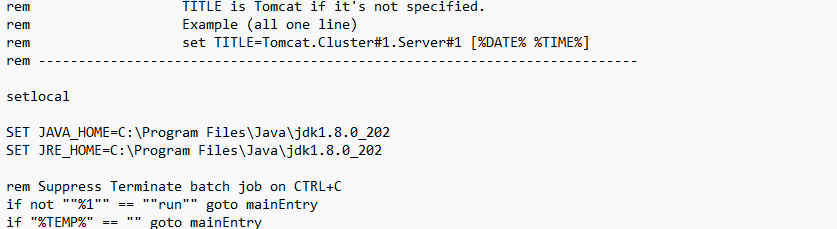

## Test avec des commandes
### Lancement du serveur
- Exécutez le fichier `start.bat`.
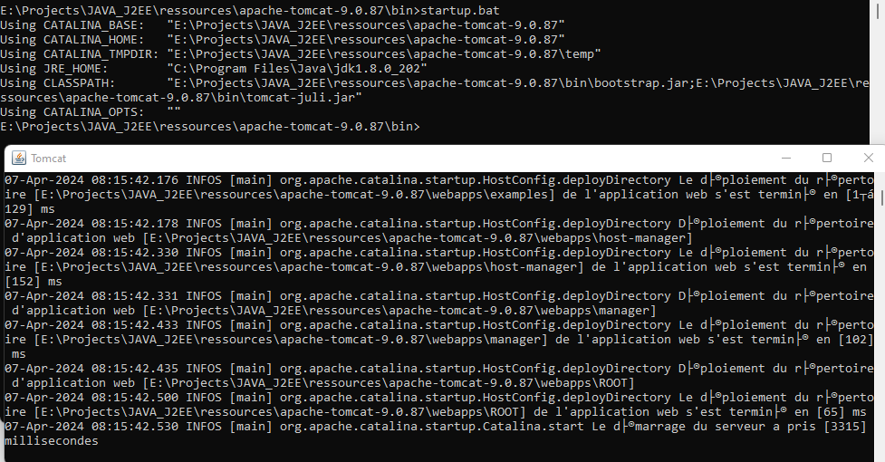

- Attention : si votre port 8080 est déjà utilisé par d'autres processus, il faut le liberer car Tomcat utilise  ce port:
	Lancer CMD en tant  qu'administrateur:
##
	netstat -ano | findstr :8080  
	taskkill /f /PID <pid_trouvé>
	
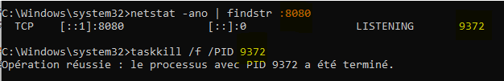

### Accès via le navigateur
- Ouvrez votre navigateur web et accédez à l'URL `localhost:8080`.
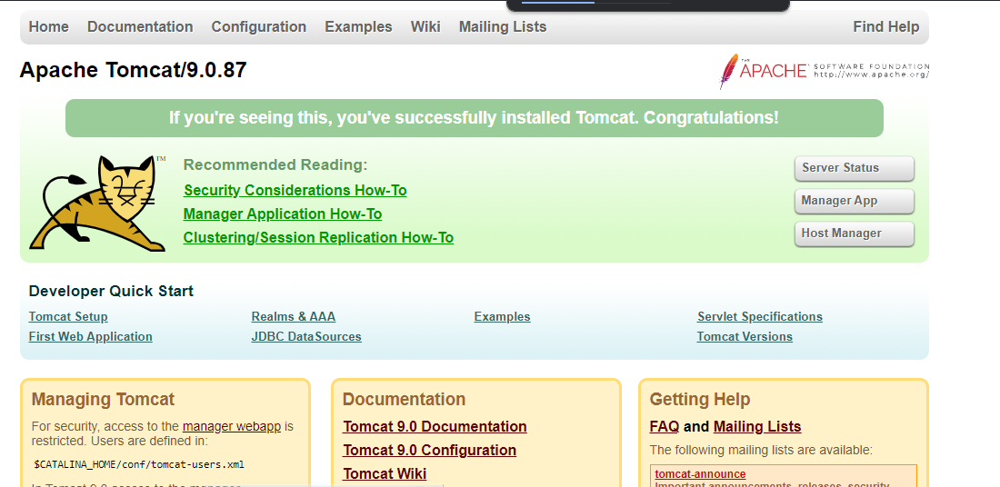

### Arrêt du serveur
- Exécutez le fichier `shutdown.bat`.

## Intégration dans Eclipse
- Ajouter le serveur Tomcat à l'Eclipse : `Windows > Preferences >Server > Runtime Environments`
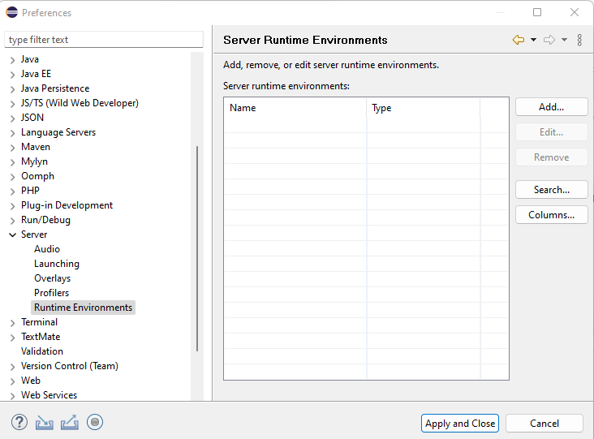

	- `Add > Apache > Tomcat V9.0  > Next`  
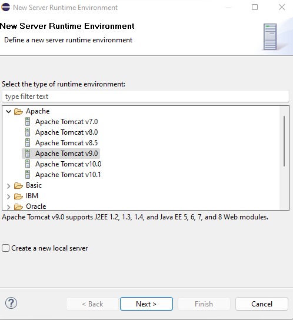

	- Choisir le reptoire de votre Tomcat  

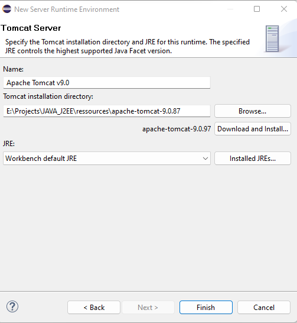

- Si Vous n'avez pas de serveur dans votre Eclipse , Il faut l'ajouter  
	`Help > Install New Software`

	-Choisissez première URL et cochez ensuite `Web, XML, Java JEE ...`  
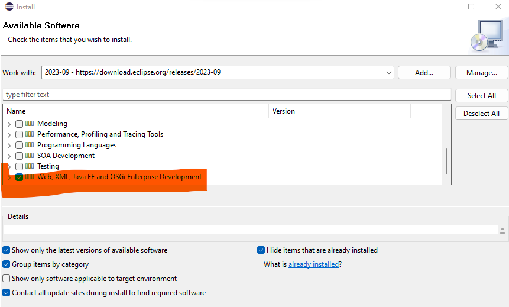

- Voir le serveur : `Windows > Show View > Server > Servers `  
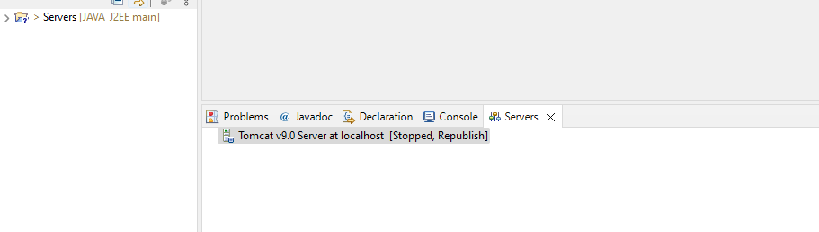

-Vous devez avoir cette interface si vous cliquez 2 fois sur le serveur  
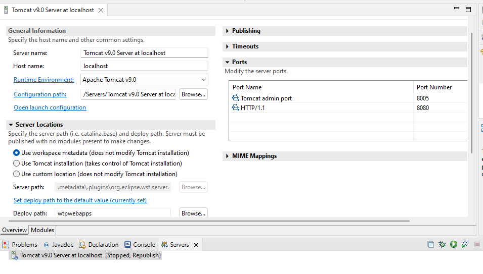

-Maintenant Vous pouvez lancer et arreter le serveur Tomacat avec les boutons qui sont en haut à droite 
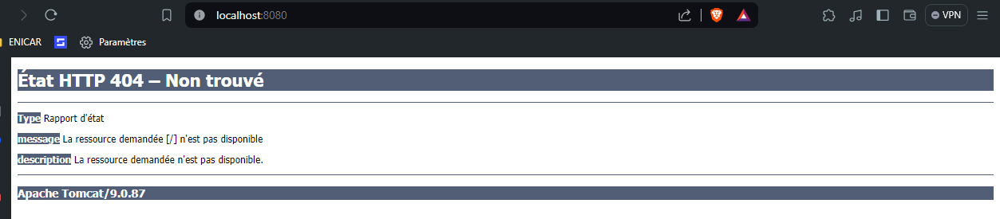

E:\Projects\JAVA_J2EE\assets

