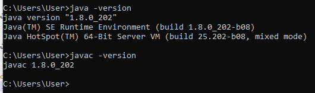

# Exercice 1:

## Différence entre JDK et JRE

- **JDK (Java Development Kit)** :
  Le JDK, ou Kit de développement Java, est un ensemble d'outils et de bibliothèques nécessaires pour développer des applications Java. Il comprend le JRE ainsi que des outils de développement tels que le compilateur Java (javac), l'outil de génération de documentation (javadoc) et divers autres outils de développement et de débogage.

- **JRE (Java Runtime Environment)** :
  Le JRE, ou Environnement d'exécution Java, est un ensemble d'outils et de bibliothèques nécessaires pour exécuter des applications Java. Il comprend la machine virtuelle Java (JVM), qui est responsable de l'exécution du bytecode Java, ainsi que d'autres bibliothèques et composants nécessaires à l'exécution des applications Java.

## Commandes pour vérifier les versions

- La commande `java -version` affiche la version de la machine virtuelle Java (JVM) installée sur votre système. Cela inclut des informations sur la version de Java et d'autres détails pertinents.

- La commande `javac -version` affiche la version du compilateur Java (javac) installée sur votre système. Cela inclut des informations sur la version du compilateur Java et d'autres détails pertinents.
