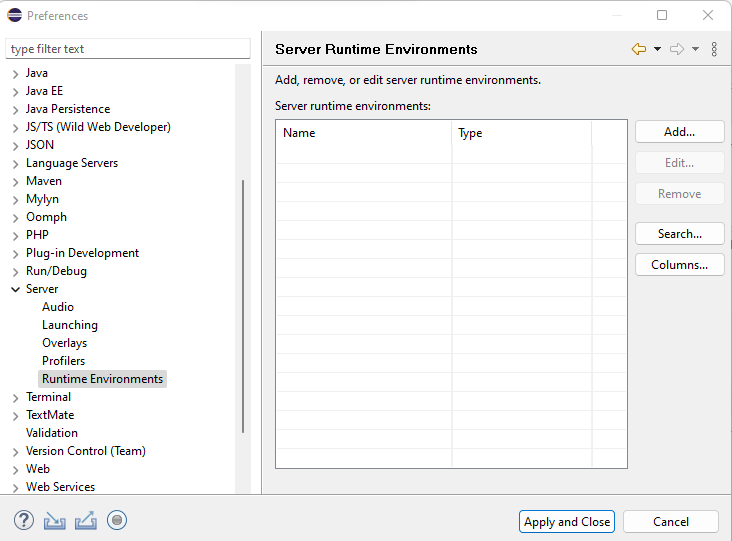
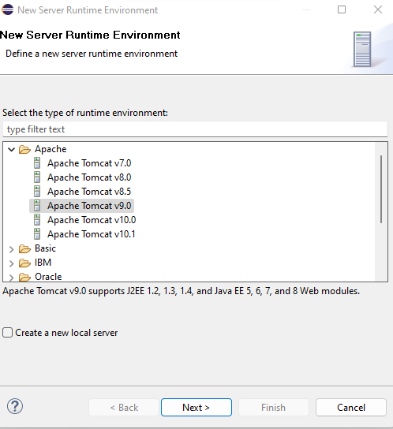
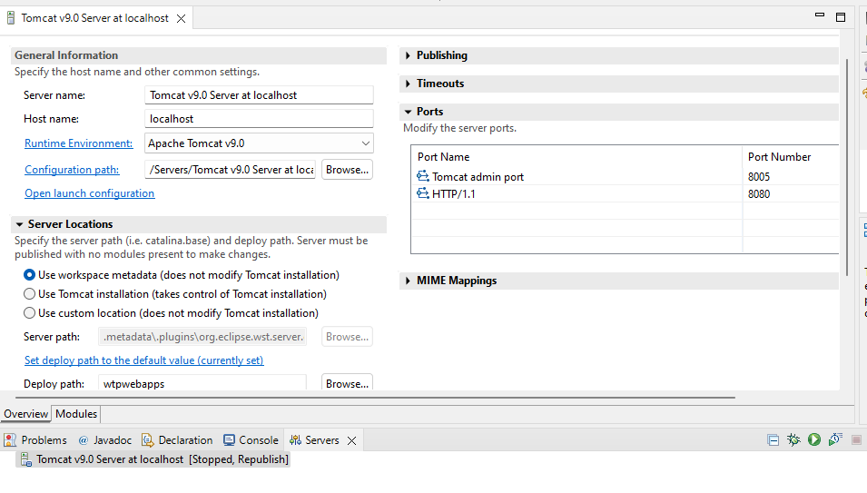
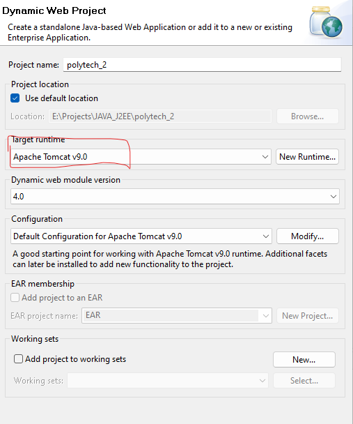

# Exercice 1:

## Différence entre JDK et JRE

- **JDK (Java Development Kit)** :
  Le JDK, ou Kit de développement Java, est un ensemble d'outils et de bibliothèques nécessaires pour développer des applications Java. Il comprend le JRE ainsi que des outils de développement tels que le compilateur Java (javac), l'outil de génération de documentation (javadoc) et divers autres outils de développement et de débogage.

- **JRE (Java Runtime Environment)** :
  Le JRE, ou Environnement d'exécution Java, est un ensemble d'outils et de bibliothèques nécessaires pour exécuter des applications Java. Il comprend la machine virtuelle Java (JVM), qui est responsable de l'exécution du bytecode Java, ainsi que d'autres bibliothèques et composants nécessaires à l'exécution des applications Java.

## Commandes pour vérifier les versions

- La commande `java -version` affiche la version de la machine virtuelle Java (JVM) installée sur votre système. Cela inclut des informations sur la version de Java et d'autres détails pertinents.

- La commande `javac -version` affiche la version du compilateur Java (javac) installée sur votre système. Cela inclut des informations sur la version du compilateur Java et d'autres détails pertinents.

# Exercice 2 : Installation
## Installation
1. Pour installer le serveur Tomcat, téléchargez le fichier ZIP de [Tomcat version 9](https://tomcat.apache.org/download-90.cgi) depuis le site officiel ou depuis le dossier des ressources de ce dépôt.
2. Extrayez le fichier ZIP à l'emplacement de votre choix sur votre système.
3. Dans le répertoire `apache-tomcat-9.0.87\bin`, ouvrez le fichier `catalina.bat` et ajoutez les lignes suivantes après la ligne `setlocal` :
##
	SET JAVA_HOME=C:\Programmes\Java\jdk<version>  
	SET JRE_HOME=C:\Program Files\Java\jdk<version> 
	
4-Assurez-vous de remplacer `<version>` par la version de votre installation Java. Vous pouvez trouver la version de Java installée sur votre système en accédant au répertoire `C:\Program Files\Java\`.

## Test avec des commandes
### Lancement du serveur
- Exécutez le fichier `start.bat`.

- Attention : si votre port 8080 est déjà utilisé par d'autres processus, il faut le liberer car Tomcat utilise  ce port:
	Lancer CMD en tant  qu'administrateur:
##
	netstat -ano | findstr :8080  
	taskkill /f /PID <pid_trouvé>
	

### Accès via le navigateur
- Ouvrez votre navigateur web et accédez à l'URL `localhost:8080`.

### Arrêt du serveur
- Exécutez le fichier `shutdown.bat`.

## Intégration dans Eclipse
- Ajouter le serveur Tomcat à l'Eclipse : `Windows > Preferences >Server > Runtime Environments`

	- `Add > Apache > Apache Tomcat V9.0  > Next`  

	- Choisir le reptoire de votre Tomcat  

- Si Vous n'avez pas de serveur dans votre Eclipse , Il faut l'ajouter  
	`Help > Install New Software`

	-Choisissez première URL et cochez ensuite `Web, XML, Java JEE ...`  

- Voir le serveur : `Windows > Show View > Server > Servers `  

- Vous devez avoir cette interface si vous cliquez 2 fois sur le serveur  

- Maintenant Vous pouvez lancer et arreter le serveur Tomacat avec les boutons qui sont en haut à droite  

Ceci indique que le serveur Tomcat est lancé 

# Creation de projet : web dynamic project 

- Attention ne pas laisser `Target Runtime : None ` sinon vous allez avoir des problèemes pour lancer ce projet  
- Il faut donc selectionner le `serveur Tomcat `  

