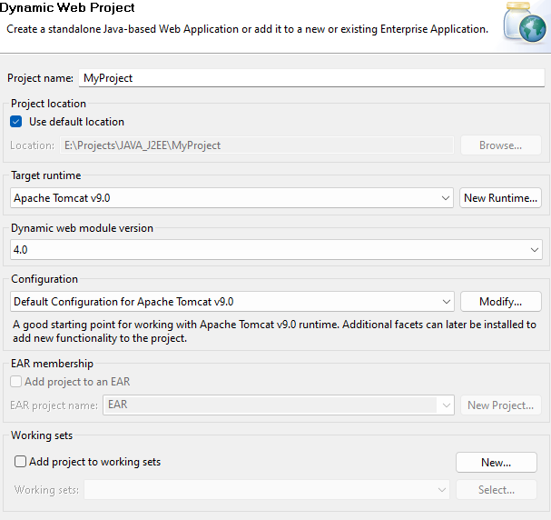

## Création de premier Servlet

### 1 - Creation du projet MonProjet 
`File > New > Other ... > Dynamic Web Projet `  
	N'oubliez surtout pas de selectionner votre serveur Tomcat dans le Target Runtime  

### 2- Creation de premier Servlet
- Créer d'abord un package `myPackage.servlets`  
- Créer en suite un servlet `Right Clic > New > Servlet ` : `PremiereServlet`  
##
	package myPackage.servelts;

	import java.io.IOException;
	import javax.servlet.ServletException;
	import javax.servlet.annotation.WebServlet;
	import javax.servlet.http.HttpServlet;
	import javax.servlet.http.HttpServletRequest;
	import javax.servlet.http.HttpServletResponse;

	/**
	 * Servlet implementation class PremiereServlet
	 */
	@WebServlet("/PremiereServlet")
	public class PremiereServlet extends HttpServlet {
		private static final long serialVersionUID = 1L;
		   
		/**
		 * @see HttpServlet#HttpServlet()
		 */
		public PremiereServlet() {
			super();
			// TODO Auto-generated constructor stub
		}

		/**
		 * @see HttpServlet#doGet(HttpServletRequest request, HttpServletResponse response)
		 */
		protected void doGet(HttpServletRequest request, HttpServletResponse response) throws ServletException, IOException {
			// TODO Auto-generated method stub
			response.getWriter().append("Served at: ").append(request.getContextPath());
		}

		/**
		 * @see HttpServlet#doPost(HttpServletRequest request, HttpServletResponse response)
		 */
		protected void doPost(HttpServletRequest request, HttpServletResponse response) throws ServletException, IOException {
			// TODO Auto-generated method stub
			doGet(request, response);
		}

	}
