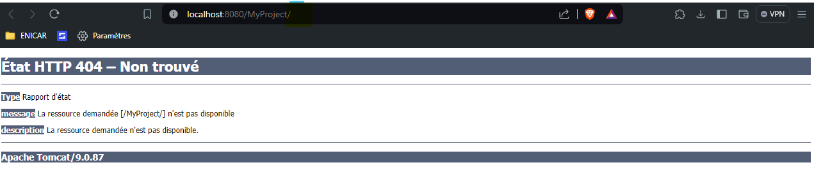

## Création de premier Servlet

### 1 - Creation du projet MonProjet 
`File > New > Other ... > Dynamic Web Projet `  
	N'oubliez surtout pas de selectionner votre serveur Tomcat dans le Target Runtime  

### 2- Creation de premier Servlet
- Créer d'abord un package `myPackage.servlets`  
- Créer en suite un servlet `Right Clic > New > Servlet ` : `PremiereServlet`  
##
	package myPackage.servelts;

	import java.io.IOException;
	import javax.servlet.ServletException;
	import javax.servlet.annotation.WebServlet;
	import javax.servlet.http.HttpServlet;
	import javax.servlet.http.HttpServletRequest;
	import javax.servlet.http.HttpServletResponse;

	/**
	 * Servlet implementation class PremiereServlet
	 */
	@WebServlet("/PremiereServlet")
	public class PremiereServlet extends HttpServlet {
		private static final long serialVersionUID = 1L;
		   
		/**
		 * @see HttpServlet#HttpServlet()
		 */
		public PremiereServlet() {
			super();
			// TODO Auto-generated constructor stub
		}

		/**
		 * @see HttpServlet#doGet(HttpServletRequest request, HttpServletResponse response)
		 */
		protected void doGet(HttpServletRequest request, HttpServletResponse response) throws ServletException, IOException {
			// TODO Auto-generated method stub
			response.getWriter().append("Served at: ").append(request.getContextPath());
		}

		/**
		 * @see HttpServlet#doPost(HttpServletRequest request, HttpServletResponse response)
		 */
		protected void doPost(HttpServletRequest request, HttpServletResponse response) throws ServletException, IOException {
			// TODO Auto-generated method stub
			doGet(request, response);
		}

	}

### Les différentes methodes :
- **doGet()** : pour traiter la requette `GET`
- **doPost()** : pour traiter la requette `POST`

## 3-Complétez la méthode doGet() de sorte qu’elle génère la sortie html suivante
	<!DOCTYPE html>
	<html>
		<head>
			<title>Example</title>
		</head>
		<body>
			
 C'est ma première servlet !

		</body>
	</html>

- La méthode `doGet()` :  
###
	protected void doGet(HttpServletRequest request, HttpServletResponse response) throws ServletException, IOException {
		// TODO Auto-generated method stub
		response.setContentType("text/html");
		PrintWriter out = response.getWriter();
		out.println("<!DOCTYPE html>"
				+ "<html>"
				+ "<head>"
				+ "<title>Example</title>"
				+ "</head>"
				+ "<body>"
				+ "
 C'est ma première servlet !
"
				+ "</body>"
				+ "</html>");
	}

## 4- Testez l’exécution de votre servlet depuis Eclipse.
- Lancer le projet (Run on server )  

- Il faut bien specifier l'URL dans `@WebServlet("/PremiereServlet")`  au dessus de la classe 
##
	@WebServlet("/PremiereServlet")
	public class PremiereServlet extends HttpServlet {.....}   

## 5- Modifiez l’annotation adéquate de sorte que votre servlet s’exécute lors d’une demande d’accès à la ressource nommée bonjour.

