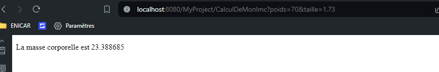
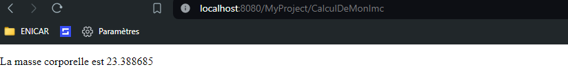

# Exercise 2 : Récupérer des données transmises par le client

## 1. Créez une servlet nommée CalculDeMonImc qui affichera l’indice de masse corporelle sur l’écran du navigateur
### Prendre les parametres de la quette 
	request.getParameter("nom_params");
### Toujous il faut convertir sinon (string)
	float poids=Float.parseFloat(request.getParameter("poids"));
	float taille=Float.parseFloat(request.getParameter("taille"));

##
	package myPackage.servelts;

	import java.io.IOException;
	import javax.servlet.ServletException;
	import javax.servlet.annotation.WebServlet;
	import javax.servlet.http.HttpServlet;
	import javax.servlet.http.HttpServletRequest;
	import javax.servlet.http.HttpServletResponse;

	import java.io.PrintWriter;

	/**
	 * Servlet implementation class CalculDeMonImc
	 */
	@WebServlet("/CalculDeMonImc")
	public class CalculDeMonImc extends HttpServlet {
		private static final long serialVersionUID = 1L;
		   
		/**
		 * @see HttpServlet#HttpServlet()
		 */
		public CalculDeMonImc() {
			super();
			// TODO Auto-generated constructor stub
		}

		/**
		 * @see HttpServlet#doGet(HttpServletRequest request, HttpServletResponse response)
		 */
		protected void doGet(HttpServletRequest request, HttpServletResponse response) throws ServletException, IOException {
			// Type du retour
			response.setContentType("text/html");
			//Get parametters
			float poids=Float.parseFloat(request.getParameter("poids"));
			float taille=Float.parseFloat(request.getParameter("taille"));
			// Writter
			PrintWriter out = response.getWriter();
			
			out.println("<!DOCTYPE html>"
					+ "<html>"
					+ "<head>"
					+ "<title>Example</title>"
					+ "</head>"
					+ "<body>"
					+ "
 La masse corporelle est "+poids/(taille*taille)+"
"
					+ "</body>"
					+ "</html>");
			
		}

		/**
		 * @see HttpServlet#doPost(HttpServletRequest request, HttpServletResponse response)
		 */
		protected void doPost(HttpServletRequest request, HttpServletResponse response) throws ServletException, IOException {
			// TODO Auto-generated method stub
			doGet(request, response);
		}

	}

## 2. Créez un formulaire html statique nommé renseignement.html qui lors de sa soumission fait appel à la servlet précédente en get. Ce formulaire pourra avoir l’apparence de celle donnée sur la figure 1.
- Ajouter `renseignement.html` `webapp`  
- Formulaire : Action=`/NomProjet/Url_Servlet` Method=`GET`
##
	<!DOCTYPE html>
	<html lang="en">
	<head>
		<meta charset="UTF-8">
		<meta name="viewport" content="width=device-width, initial-scale=1.0">
		<title>Calculateur IMC</title>
	</head>
	<body>

	<form class="container" action="/MyProject/CalculDeMonImc" method="get">
		<!-- Label pour le poids -->
		<label for="poids">Poids:</label>
		<!-- Input pour le poids -->
		<input type="text" name="poids" id="poids" required>

		<!-- Label pour la taille -->
		<label for="taille">Taille:</label>
		<!-- Input pour la taille -->
		<input type="text" name="taille" id="taille" required>

		<!-- Bouton pour calculer -->
		<button type="submit" id="calculer">Calculer</button>
	</form>

	</body>
	</html>

## 3. Test 
- Formulaire  

- reponse   

## 4 . Requette de type POST au lieu de GET`

- Formulaire : il faut changer methode du formulaire  `method=post`

- Servlet : Dans la `doPost` appeller `doGet` :
#
	/**
	 * @see HttpServlet#doPost(HttpServletRequest request, HttpServletResponse response)
	 */
	protected void doPost(HttpServletRequest request, HttpServletResponse response) throws ServletException, IOException {
		// TODO Auto-generated method stub
		doGet(request, response);
	}

- Meme resultat

E:\Projects\JAVA_J2EE\assets