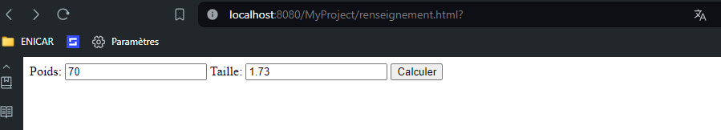

# Exercice 3 (Une classe “métier” dans notre application web)
Dans cet exercice, nous allons commencer à découpler la partie business (logique) de la partie
vue (affichage).
- 1. Créez une classe java nommée `Imc`.  
	`Créer un package myPackage.metiers`
- 2. Ajoutez les deux attributs privés suivants à cette classe : `taille` et `poids` qui seront de type double.  
- 3. Ajoutez un constructeur avec comme prototype : `public Imc(double taille, double poids);`  
- 4. Ajoutez une méthode qui calcule l’imc avec le prototype suivant :`double calcul();` 

## Mon metier Imc
	package myPackage.metiers;

	public class Imc {
		private double poids, taille;
		
		public Imc(double taille, double poids) {
			this.poids=poids;this.taille=taille;
		}
		
		public double calcul() {
			return poids/(taille*taille);
		}
		
	}

## Mon Servlet 
- 5. Modifiez la servlet CalculDeMonImc pour qu’elle s’appuie sur un objet de la classe Imcafin de faire le calcul.  
(a) Où avez-vous déclaré votre objet ?  ==> ` Dans la classe`   
(b) dans quelle méthode l’avez construit ?  ==> ` doGet()`  
(c) quelle est la portée de cet objet ?  ==> ` Globale : toute la classe` 

##
	package myPackage.servelts;

	import myPackage.metiers.*;

	import java.io.IOException;
	import javax.servlet.ServletException;
	import javax.servlet.annotation.WebServlet;
	import javax.servlet.http.HttpServlet;
	import javax.servlet.http.HttpServletRequest;
	import javax.servlet.http.HttpServletResponse;

	import java.io.PrintWriter;

	/**
	 * Servlet implementation class CalculDeMonImc
	 */
	@WebServlet("/CalculDeMonImc")
	public class CalculDeMonImc extends HttpServlet {
		private static final long serialVersionUID = 1L;
		
		private Imc monImc;
		   
		/**
		 * @see HttpServlet#HttpServlet()
		 */
		public CalculDeMonImc() {
			super();
			// TODO Auto-generated constructor stub
		}

		/**
		 * @see HttpServlet#doGet(HttpServletRequest request, HttpServletResponse response)
		 */
		protected void doGet(HttpServletRequest request, HttpServletResponse response) throws ServletException, IOException {
			// Type du retour
			response.setContentType("text/html");
			
			//Declarer Imc 
			this.monImc=new Imc(Double.parseDouble(request.getParameter("taille")),Double.parseDouble(request.getParameter("poids")));
			
			// Writter
			PrintWriter out = response.getWriter();
			
			out.println("<!DOCTYPE html>"
					+ "<html>"
					+ "<head>"
					+ "<title>Example</title>"
					+ "</head>"
					+ "<body>"
					+ "
 La masse corporelle est "+this.monImc.calcul()+"
"
					+ "</body>"
					+ "</html>");
			
		}

		/**
		 * @see HttpServlet#doPost(HttpServletRequest request, HttpServletResponse response)
		 */
		protected void doPost(HttpServletRequest request, HttpServletResponse response) throws ServletException, IOException {
			// TODO Auto-generated method stub
			doGet(request, response);
		}

	}

## Resultat

- Formulaire  

- Reponse de Servlet  
  