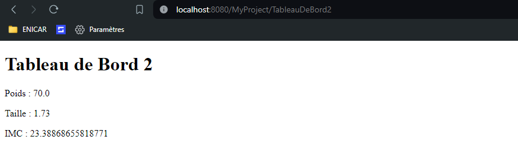

# Exercice 4 (Cookies et Sessions)
Cet exercice est dans la continuité du précédent.
### 1 L’objectif de cette question est de créer une page `/TableauDeBord` qui affiche les données `(poids, taille, imc)`, pour ce faire, vous devez :  
- ajouter, dans la servlet `/CalculDeMonImc`, une écriture de **cookies**, 
#
	package myPackage.servelts;

	import myPackage.metiers.*;

	import java.io.IOException;
	import javax.servlet.ServletException;
	import javax.servlet.annotation.WebServlet;
	import javax.servlet.http.Cookie;
	import javax.servlet.http.HttpServlet;
	import javax.servlet.http.HttpServletRequest;
	import javax.servlet.http.HttpServletResponse;

	import java.io.PrintWriter;

	/**
	 * Servlet implementation class CalculDeMonImc
	 */
	@WebServlet("/CalculDeMonImc")
	public class CalculDeMonImc extends HttpServlet {
		private static final long serialVersionUID = 1L;
		
		private Imc monImc;
		   
		/**
		 * @see HttpServlet#HttpServlet()
		 */
		public CalculDeMonImc() {
			super();
			// TODO Auto-generated constructor stub
		}

		/**
		 * @see HttpServlet#doGet(HttpServletRequest request, HttpServletResponse response)
		 */
		protected void doGet(HttpServletRequest request, HttpServletResponse response) throws ServletException, IOException {
			response.setContentType("text/html");
			
			// Récupération des paramètres poids et taille
			double poids = Double.parseDouble(request.getParameter("poids"));
			double taille = Double.parseDouble(request.getParameter("taille"));
			
			// Calcul de l'IMC
			this.monImc = new Imc(taille, poids);
			double imc = this.monImc.calcul();
			
			// Création des cookies
			Cookie cookiePoids = new Cookie("poids", Double.toString(poids));
			Cookie cookieTaille = new Cookie("taille", Double.toString(taille));
			Cookie cookieImc = new Cookie("imc", Double.toString(imc));
			
			// Ajout des cookies à la réponse
			response.addCookie(cookiePoids);
			response.addCookie(cookieTaille);
			response.addCookie(cookieImc);
			
			// Redirection vers la servlet TableauDeBord
			response.sendRedirect("TableauDeBord");
			
		}

		/**
		 * @see HttpServlet#doPost(HttpServletRequest request, HttpServletResponse response)
		 */
		protected void doPost(HttpServletRequest request, HttpServletResponse response) throws ServletException, IOException {
			// TODO Auto-generated method stub
			doGet(request, response);
		}

	}

- ajouter, dans la servlet `/TableauDeBord`, une lecture des **cookies**.. 
#
	package myPackage.servelts;

	import java.io.IOException;
	import java.io.PrintWriter;

	import javax.servlet.ServletException;
	import javax.servlet.annotation.WebServlet;
	import javax.servlet.http.Cookie;
	import javax.servlet.http.HttpServlet;
	import javax.servlet.http.HttpServletRequest;
	import javax.servlet.http.HttpServletResponse;

	@WebServlet("/TableauDeBord")
	public class TableauDeBord extends HttpServlet {
		private static final long serialVersionUID = 1L;
		   
		public TableauDeBord() {
			super();
		}

		protected void doGet(HttpServletRequest request, HttpServletResponse response) throws ServletException, IOException {
			response.setContentType("text/html");
			
			// Récupération des cookies
			Cookie[] cookies = request.getCookies();
			double poids = 0, taille = 0, imc = 0;
			
			if (cookies != null) {
				for (Cookie cookie : cookies) {
					if (cookie.getName().equals("poids")) {
						poids = Double.parseDouble(cookie.getValue());
					} else if (cookie.getName().equals("taille")) {
						taille = Double.parseDouble(cookie.getValue());
					} else if (cookie.getName().equals("imc")) {
						imc = Double.parseDouble(cookie.getValue());
					}
				}
			}
			
			PrintWriter out = response.getWriter();
			out.println("<!DOCTYPE html>"
					+ "<html>"
					+ "<head>"
					+ "<title>Tableau de Bord</title>"
					+ "</head>"
					+ "<body>"
					+ "<h1>Tableau de Bord</h1>"
					+ "
Poids : " + poids + "
"
					+ "
Taille : " + taille + "
"
					+ "
IMC : " + imc + "
"
					+ "</body>"
					+ "</html>");
		}

		protected void doPost(HttpServletRequest request, HttpServletResponse response) throws ServletException, IOException {
			doGet(request, response);
		}
	}
 
### 2 Avec Firefox, scrutez les échanges entre votre navigateur et le serveur. Quand les cookies sont-ils transmis ? (Indication : allez voir dans Stockage).  

### 3 Que se passe-t-il si vous allez directement chercher la ressource `/TableauDeBord` avec un autre navigateur (Microsoft Edge ou bien en navigation privée si vous n’avez pas d’autre navigateur).  
- Pas de cookie :  

### 4 :
- Les données sont stockées dans les cookies sur le navigateur client. Si le serveur d'applications est arrêté, les cookies ne seront plus disponibles pour les futures requêtes, mais les données resteront sur le navigateur client tant qu'elles ne seront pas supprimées ou expirées conformément à leur configuration.

## Sessions

### Ecriture 
	package myPackage.servelts;

	import java.io.IOException;
	import javax.servlet.ServletException;
	import javax.servlet.annotation.WebServlet;
	import javax.servlet.http.HttpServlet;
	import javax.servlet.http.HttpServletRequest;
	import javax.servlet.http.HttpServletResponse;
	import javax.servlet.http.HttpSession;

	import myPackage.metiers.Imc;

	/**
	 * Servlet implementation class CalculDeMonImc2
	 */
	@WebServlet("/CalculDeMonImc2")
	public class CalculDeMonImc2 extends HttpServlet {
		private static final long serialVersionUID = 1L;
		
		private Imc monImc;
		   

		public CalculDeMonImc2() {
			super();
			// TODO Auto-generated constructor stub
		}

		protected void doGet(HttpServletRequest request, HttpServletResponse response) throws ServletException, IOException {
			// Récupération des paramètres poids et taille
			double poids = Double.parseDouble(request.getParameter("poids"));
			double taille = Double.parseDouble(request.getParameter("taille"));
			
			// Calcul de l'IMC
			this.monImc = new Imc(taille, poids);
			double imc = this.monImc.calcul();
			
			// Stockage des données dans la session
			HttpSession session = request.getSession();
			session.setAttribute("poids", poids);
			session.setAttribute("taille", taille);
			session.setAttribute("imc", imc);
			
		 // Redirection vers la servlet TableauDeBord
			response.sendRedirect("TableauDeBord2");
		}

		/**
		 * @see HttpServlet#doPost(HttpServletRequest request, HttpServletResponse response)
		 */
		protected void doPost(HttpServletRequest request, HttpServletResponse response) throws ServletException, IOException {
			// TODO Auto-generated method stub
			doGet(request, response);
		}

	}

### Lecture 
	package myPackage.servelts;

	import java.io.IOException;
	import java.io.PrintWriter;

	import javax.servlet.ServletException;
	import javax.servlet.annotation.WebServlet;
	import javax.servlet.http.HttpServlet;
	import javax.servlet.http.HttpServletRequest;
	import javax.servlet.http.HttpServletResponse;
	import javax.servlet.http.HttpSession;

	/**
	 * Servlet implementation class TableauDeBord2
	 */
	@WebServlet("/TableauDeBord2")
	public class TableauDeBord2 extends HttpServlet {
		private static final long serialVersionUID = 1L;
		   
		/**
		 * @see HttpServlet#HttpServlet()
		 */
		public TableauDeBord2() {
			super();
			// TODO Auto-generated constructor stub
		}

		/**
		 * @see HttpServlet#doGet(HttpServletRequest request, HttpServletResponse response)
		 */
		protected void doGet(HttpServletRequest request, HttpServletResponse response) throws ServletException, IOException {
			// TODO Auto-generated method stub
			HttpSession session = request.getSession();
			double poids = (double) session.getAttribute("poids");
			double taille = (double) session.getAttribute("taille");
			double imc = (double) session.getAttribute("imc");
			
			PrintWriter out = response.getWriter();
			out.println("<!DOCTYPE html>"
					+ "<html>"
					+ "<head>"
					+ "<title>Tableau de Bord</title>"
					+ "</head>"
					+ "<body>"
					+ "<h1>Tableau de Bord 2</h1>"
					+ "
Poids : " + poids + "
"
					+ "
Taille : " + taille + "
"
					+ "
IMC : " + imc + "
"
					+ "</body>"
					+ "</html>");
		}

		/**
		 * @see HttpServlet#doPost(HttpServletRequest request, HttpServletResponse response)
		 */
		protected void doPost(HttpServletRequest request, HttpServletResponse response) throws ServletException, IOException {
			// TODO Auto-generated method stub
			doGet(request, response);
		}

	}

## Resultat (modifier renseignement.html : TableauDeBord => TableauDeBord2)

- Formulaire  

- Reponse de Servlet  
  

### Du point de vue du développeur web, laquelle de ces technologies est la meilleure pour sauvegarder ces données ? même question d’un point de vue réseau et sécurité ?

- Du point de vue du développeur web, la meilleure technologie pour sauvegarder ces données dépend des besoins spécifiques de l'application :  
	 - Si les données sont sensibles et doivent être stockées côté serveur de manière sécurisée, l'utilisation de sessions avec HttpSession est généralement préférable. Les données sont stockées sur le serveur et ne sont pas transmises entre le client et le serveur à chaque requête, ce qui réduit les risques d'interception ou de modification malveillante.  

	- Cependant, si les données sont relativement simples et non sensibles, l'utilisation de cookies peut être une option plus simple et plus légère. Cependant, il convient de noter que les cookies sont stockés sur le client et peuvent être sujets à des manipulations par l'utilisateur, donc ils ne sont pas adaptés au stockage de données sensibles ou critiques.

