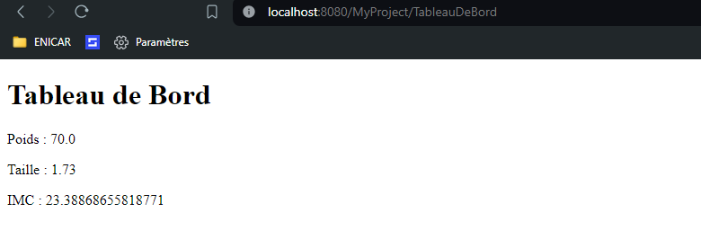
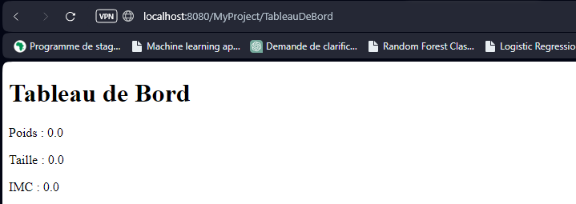

# Exercice 4 (Cookies et Sessions)
Cet exercice est dans la continuité du précédent.
### 1 L’objectif de cette question est de créer une page `/TableauDeBord` qui affiche les données `(poids, taille, imc)`, pour ce faire, vous devez :  
- ajouter, dans la servlet `/CalculDeMonImc`, une écriture de **cookies**, 
#
	package myPackage.servelts;

	import myPackage.metiers.*;

	import java.io.IOException;
	import javax.servlet.ServletException;
	import javax.servlet.annotation.WebServlet;
	import javax.servlet.http.Cookie;
	import javax.servlet.http.HttpServlet;
	import javax.servlet.http.HttpServletRequest;
	import javax.servlet.http.HttpServletResponse;

	import java.io.PrintWriter;

	/**
	 * Servlet implementation class CalculDeMonImc
	 */
	@WebServlet("/CalculDeMonImc")
	public class CalculDeMonImc extends HttpServlet {
		private static final long serialVersionUID = 1L;
		
		private Imc monImc;
		   
		/**
		 * @see HttpServlet#HttpServlet()
		 */
		public CalculDeMonImc() {
			super();
			// TODO Auto-generated constructor stub
		}

		/**
		 * @see HttpServlet#doGet(HttpServletRequest request, HttpServletResponse response)
		 */
		protected void doGet(HttpServletRequest request, HttpServletResponse response) throws ServletException, IOException {
			response.setContentType("text/html");
			
			// Récupération des paramètres poids et taille
			double poids = Double.parseDouble(request.getParameter("poids"));
			double taille = Double.parseDouble(request.getParameter("taille"));
			
			// Calcul de l'IMC
			this.monImc = new Imc(taille, poids);
			double imc = this.monImc.calcul();
			
			// Création des cookies
			Cookie cookiePoids = new Cookie("poids", Double.toString(poids));
			Cookie cookieTaille = new Cookie("taille", Double.toString(taille));
			Cookie cookieImc = new Cookie("imc", Double.toString(imc));
			
			// Ajout des cookies à la réponse
			response.addCookie(cookiePoids);
			response.addCookie(cookieTaille);
			response.addCookie(cookieImc);
			
			// Redirection vers la servlet TableauDeBord
			response.sendRedirect("TableauDeBord");
			
		}

		/**
		 * @see HttpServlet#doPost(HttpServletRequest request, HttpServletResponse response)
		 */
		protected void doPost(HttpServletRequest request, HttpServletResponse response) throws ServletException, IOException {
			// TODO Auto-generated method stub
			doGet(request, response);
		}

	}

- ajouter, dans la servlet `/TableauDeBord`, une lecture des **cookies**.. 
#
	package myPackage.servelts;

	import java.io.IOException;
	import java.io.PrintWriter;

	import javax.servlet.ServletException;
	import javax.servlet.annotation.WebServlet;
	import javax.servlet.http.Cookie;
	import javax.servlet.http.HttpServlet;
	import javax.servlet.http.HttpServletRequest;
	import javax.servlet.http.HttpServletResponse;

	@WebServlet("/TableauDeBord")
	public class TableauDeBord extends HttpServlet {
		private static final long serialVersionUID = 1L;
		   
		public TableauDeBord() {
			super();
		}

		protected void doGet(HttpServletRequest request, HttpServletResponse response) throws ServletException, IOException {
			response.setContentType("text/html");
			
			// Récupération des cookies
			Cookie[] cookies = request.getCookies();
			double poids = 0, taille = 0, imc = 0;
			
			if (cookies != null) {
				for (Cookie cookie : cookies) {
					if (cookie.getName().equals("poids")) {
						poids = Double.parseDouble(cookie.getValue());
					} else if (cookie.getName().equals("taille")) {
						taille = Double.parseDouble(cookie.getValue());
					} else if (cookie.getName().equals("imc")) {
						imc = Double.parseDouble(cookie.getValue());
					}
				}
			}
			
			PrintWriter out = response.getWriter();
			out.println("<!DOCTYPE html>"
					+ "<html>"
					+ "<head>"
					+ "<title>Tableau de Bord</title>"
					+ "</head>"
					+ "<body>"
					+ "<h1>Tableau de Bord</h1>"
					+ "
Poids : " + poids + "
"
					+ "
Taille : " + taille + "
"
					+ "
IMC : " + imc + "
"
					+ "</body>"
					+ "</html>");
		}

		protected void doPost(HttpServletRequest request, HttpServletResponse response) throws ServletException, IOException {
			doGet(request, response);
		}
	}
 
### 2 Avec Firefox, scrutez les échanges entre votre navigateur et le serveur. Quand les cookies sont-ils transmis ? (Indication : allez voir dans Stockage).  

### 3 Que se passe-t-il si vous allez directement chercher la ressource `/TableauDeBord` avec un autre navigateur (Microsoft Edge ou bien en navigation privée si vous n’avez pas d’autre navigateur).  
- Pas de cookie :  
