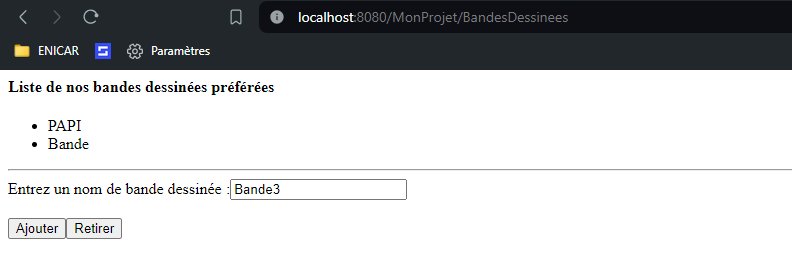

# Exercice 5 : BandesDessinees 
	package myPackage.servelts;

	import java.io.IOException;
	import java.io.PrintWriter;
	import java.util.ArrayList;

	import javax.servlet.ServletException;
	import javax.servlet.annotation.WebServlet;
	import javax.servlet.http.HttpServlet;
	import javax.servlet.http.HttpServletRequest;
	import javax.servlet.http.HttpServletResponse;

	@WebServlet("/BandesDessinees")
	public class BandesDessinees extends HttpServlet {
		private static final long serialVersionUID = 1L;
		private ArrayList<String> listeBandesDessinees;

		public BandesDessinees() {
			super();
			listeBandesDessinees = new ArrayList<String>();
		}

		protected void doGet(HttpServletRequest request, HttpServletResponse response) throws ServletException, IOException {
			
			response.setContentType("text/html");
			PrintWriter out = response.getWriter();
			out.println("<html>"
					+ "<head><title>Liste de nos bandes dessinées préférées</title></head>"
					+ "<body>"
					+ "<h4>Liste de nos bandes dessinées préférées </h4><ul>");
			for(String s : listeBandesDessinees) {
				out.println("<li>"+s+"</li>");
			}
					out.println("</ul>
<form method=\"POST\" action=\"BandesDessinees\">"
					+ "Entrez un nom de bande dessinée :"
					+ "<input type=\"text\" name=\"bd\">  "
					+ "<input type=\"submit\" name=\"action\" value=\"Ajouter\">"
					+ "<input type=\"submit\" name=\"action\" value=\"Retirer\">"
					+ "</form>"
					+ "</body>"
					+ "</html>");
			
		}

		protected void doPost(HttpServletRequest request, HttpServletResponse response) throws ServletException, IOException {
			// TODO Auto-generated method stub
					String bd=request.getParameter("bd");
					response.setContentType("text/html");
					PrintWriter out = response.getWriter();
					out.println("<html>"
							+ "<head>");
					
					if(request.getParameter("action").equals("Ajouter") && !listeBandesDessinees.contains(bd)) {
						listeBandesDessinees.add(bd);
						out.println("<title>Ajout de bandes dessinées</title></head><body><h4>La bande dessinée "+bd+" a été enregistrée </h4> 
 <a href=\"http://localhost:8080/MonProjet/BandesDessinees\">Retour au formulaire</a>");
						
						
					}else if(request.getParameter("action").equals("Retirer")) {
						String html="<title>Suppression de bandes dessinées</title></head><body><h4>La bande dessinée "+bd+" n'existe pas 404!  </h4> 
 <a href=\"http://localhost:8080/MonProjet/BandesDessinees\">Retour au formulaire</a>";
						int notfound=1;
						for(String s :listeBandesDessinees) {
							if(s.equals(bd)) {
								listeBandesDessinees.remove(bd);
								out.println("<title>Suppression de bandes dessinées</title></head><body><h4>La bande dessinée "+bd+" a été supprimée </h4> 
 <a href=\"http://localhost:8080/MonProjet/BandesDessinees\">Retour au formulaire</a>");
								notfound=0;
							}
						}
						if(notfound==0)
							out.println(html);
					}
					out.println("</body></html>");
		}

	}

## Rendu
  
  
  

## 6 connaitre le nom de la ressource actuelle 
La méthode de la classe HttpServletRequest qui permet de connaître le nom de la ressource actuelle est getRequestURI(). Cette méthode peut être utilisée pour créer le lien associé au "Retour au formulaire" en ajoutant le nom de la servlet comme action dans le formulaire

## 9 L'application construit une liste commune à tous les utilisateurs

## 10 Lors de la fermeture du navigateur, la liste reste  sauvegardée car les données sont sont stockées dans la memoire Servlet mais pas dans le navigateur.

## 11 Lors de la fermeture de servlet
Lors de l'arrêt de la servlet ou du serveur d'applications, la liste disparaît car elle est stockée en mémoire dans la servlet. Lorsque la servlet est arrêtée, toutes les données en mémoire sont perdues.

## 12 Mecanisme pour sauvegarder les données de façon permanente 
Pour sauvegarder cette liste même lors d'un redéploiement, un mécanisme de stockage persistant tel qu'une base de données ou un fichier de données peut être utilisé. Ainsi, les données seront conservées même lorsque la servlet est arrêtée ou redéployée.