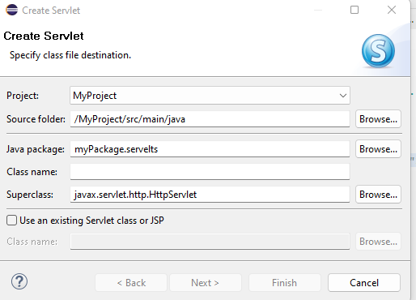

# TP2 : Servlet 

## C'est quoi un servlet ?
Un servlet est une classe Java qui s'exécute sur le côté serveur pour gérer les requêtes et les réponses HTTP dans une application web. En d'autres termes, un servlet est une composante côté serveur qui étend les fonctionnalités d'un serveur web. Une fois déployé dans un conteneur servlet, tel que Apache Tomcat ou Jetty, un servlet est chargé, initialisé et exécuté pour traiter les demandes HTTP entrantes et générer des réponses dynamiques.

- **Générer des réponses HTTP :** Les servlets sont capables de générer des réponses HTTP dynamiques à partir des requêtes entrantes. Ils peuvent créer des pages HTML, du texte, des images, des fichiers PDF, etc., en fonction de la logique métier définie dans le code servlet.
- **Gérer les requêtes HTTP :** Les servlets peuvent gérer différents types de requêtes HTTP, tels que GET, POST, PUT, DELETE, etc. Ils peuvent extraire des données des requêtes entrantes, effectuer des opérations en fonction de ces données, puis générer des réponses appropriées.
- **Traitement des sessions :** Les servlets peuvent gérer les sessions utilisateur en utilisant des mécanismes de suivi de session. Cela leur permet de maintenir l'état de l'application entre les requêtes HTTP successives d'un même utilisateur.
- **Gestion des cycles de vie :** Les servlets suivent un cycle de vie défini par le conteneur servlet. Ils sont chargés, initialisés, exécutés pour traiter les requêtes et finalement détruits lorsqu'ils ne sont plus nécessaires.
- **Extensibilité :** Les servlets peuvent être étendus pour implémenter des fonctionnalités avancées. Ils peuvent être utilisés conjointement avec d'autres technologies Java, telles que les JSP (JavaServer Pages), les filtres servlet, les listeners servlet, etc., pour créer des applications web robustes et évolutives.

## Créer servlet
- C'est comme créer une classe mais `New > Servelet` :

### URL : @WebServlet("/MyURL")
- Url pour acceder à ce servlet là est :`localhost:8080/MyProjectName/MyURL`

### Methodes :
- Il y a plusieurs methodes :
	- **doGet** : qui gère la requette de type GET qui arrive à cette URL
	- **doPost** : qui gèrer la requette de type POST qui arrive à cette URL

### Les paramettres de la requette : MyURL?param1=1&param2=torien
- les paramètres sont disponibles dans `request.getParameter("nom_params")` mais il faut les caster  
## 
	protected void doGet(HttpServletRequest request, HttpServletResponse response) throws ServletException, IOException {
		// TODO Auto-generated method stub
		
		float poids=Float.parseFloat(request.getParameter("poids"));
		float taille=Float.parseFloat(request.getParameter("taille"));
		
		PrintWriter out = response.getWriter();
		
		out.println("<!DOCTYPE html>"
				+ "<html>"
				+ "<head>"
				+ "<title>Example</title>"
				+ "</head>"
				+ "<body>"
				+ "
 La masse corporelle est "+poids/(taille*taille)+"
"
				+ "</body>"
				+ "</html>");
		
	}

### Comment renvoyer une reponse ?
	//Importer PrintWriter `import java.io.PrintWriter;`
	// Dans la fonction declarer 
	PrintWriter out = response.getWriter();
	//Et enfin donner la reponse
	out.println("ma reponse ")

### Type de la reponse 
	response.setContentType("text/html");
	

## COKIES 

## SESSIONS