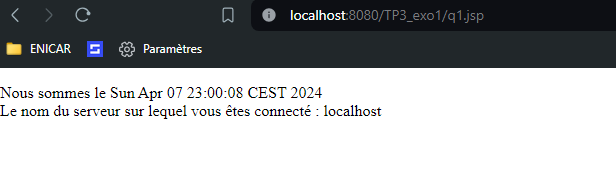
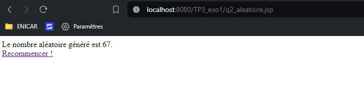

# Exercice 1 Premier pas en JSP

## Céer un projet Dynamic Web Project
- Dans webapp ou webContent : créer vos pages jsp (`New > JSP File`)

## 1 - Date 
	<%@ page import="java.util.*" %>
	<!DOCTYPE html>
	<html>
		<head> <meta charset="UTF-8"> <title>Quand et où ? </title> </head>
		<body>
			

			<% Date date = new Date(); %>
				Nous sommes le <%= date %> 
				Le nom du serveur sur lequel vous êtes connecté : localhost  
			

		</body>
	</html>
	

## 2 Nombre aléatoire 
	<%@ page language="java" contentType="text/html; charset=ISO-8859-1"
		pageEncoding="ISO-8859-1"%>
	<%@ page import="java.util.Random" %>
	<!DOCTYPE html>
	<html>
		<head>
		<meta http-equiv="Content-Type" content="text/html; charset=UTF-8">
		<title>Ne pas oublier l'import de java.util.Random ;-)</title>
		</head>
		<body>
			<% //code JAVA ICI
			Random random = new Random();
			// Génération d'un entier aléatoire entre 0 (inclus) et 100 (exclus)
			int randomNumber = random.nextInt(100);
			%>
		
			Le nombre aléatoire généré est <%= randomNumber %>.  
			<a href="/TP3_exo1/q2_aleatoire.jsp">Recommencer !</a>
		</body>
	</html>

E:\Projects\JAVA_J2EE\assets