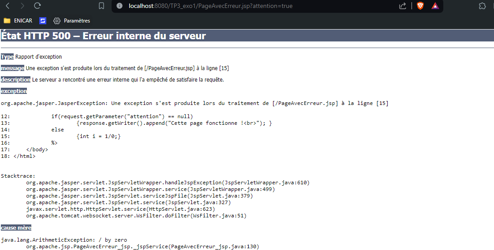
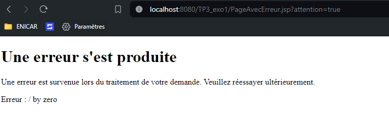

# Exercice 1 Premier pas en JSP

## Céer un projet Dynamic Web Project
- Dans webapp ou webContent : créer vos pages jsp (`New > JSP File`)

## 1 - Date 
	<%@ page import="java.util.*" %>
	<!DOCTYPE html>
	<html>
		<head> <meta charset="UTF-8"> <title>Quand et où ? </title> </head>
		<body>
			

			<% Date date = new Date(); %>
				Nous sommes le <%= date %> 
				Le nom du serveur sur lequel vous êtes connecté : localhost  
			

		</body>
	</html>
	

## 2 Nombre aléatoire 
	<%@ page language="java" contentType="text/html; charset=ISO-8859-1"
		pageEncoding="ISO-8859-1"%>
	<%@ page import="java.util.Random" %>
	<!DOCTYPE html>
	<html>
		<head>
		<meta http-equiv="Content-Type" content="text/html; charset=UTF-8">
		<title>Ne pas oublier l'import de java.util.Random ;-)</title>
		</head>
		<body>
			<% //code JAVA ICI
			Random random = new Random();
			// Génération d'un entier aléatoire entre 0 (inclus) et 100 (exclus)
			int randomNumber = random.nextInt(100);
			%>
		
		
			Le nombre aléatoire généré est <%= randomNumber %>.  
			<a href="<%= request.getRequestURI() %>">Recommencer !</a>
		</body>
	</html>

## 3 <a href="<%= request.getRequestURI() %>">Recommencer !</a>

## 4 Error page
	<%@ page language="java" contentType="text/html; charset=UTF-8"
	pageEncoding="UTF-8"%>
	<!DOCTYPE html>

	<html>
		<head>
		<meta charset="UTF-8">
		<title>Division par zero !</title>
		</head>
		<body>
			<%
			if(request.getParameter("attention") == null)
				{response.getWriter().append("Cette page fonctionne ! "); }
			else
				{int i = 1/0;}
			%>
		</body>
	</html>

## 5 Analyse du code
La page JSP nommée PageAvecErreur.jsp contient du code qui génère une erreur de division par zéro dans certaines conditions. Le code comporte une structure HTML de base avec un titre défini. À l'intérieur de balises Java embraquées, il y a une logique conditionnelle qui vérifie si un paramètre de requête est nul. Si le paramètre est nul, un message indiquant que la page fonctionne est affiché. Sinon, une erreur de division par zéro est intentionnellement déclenchée.  

Par exemple, l'URL suivante peut être utilisée pour provoquer une exception :
#
	http://localhost:8080/TP3_exo1/PageAvecErreur.jsp?attention=true

## 6 Gestion d'erreur (`errorPage="error.jsp"`)
- Ajouter un attribut import à la directive page de la page PageAvecErreur.jsp de sorte que lors d’une exception, une page nommée error.jsp prenne en charge son affichage  
- Ajouter `errorPage="error.jsp"` dans l'import 
#
	<%@ page language="java" contentType="text/html; charset=UTF-8"
	pageEncoding="UTF-8" errorPage="error.jsp" %>
	<!DOCTYPE html>

	<html>
		<head>
		<meta charset="UTF-8">
		<title>Division par zero !</title>
		</head>
		<body>
			<%
			if(request.getParameter("attention") == null)
				{response.getWriter().append("Cette page fonctionne ! "); }
			else
				{int i = 1/0;}
			%>
		</body>
	</html>

# 7 Error page (`isErrorPage="true"`)
	<%@ page language="java" contentType="text/html; charset=UTF-8"
		pageEncoding="UTF-8" isErrorPage="true" %>
	<!DOCTYPE html>
	<html>
	<head>
		<meta charset="UTF-8">
		<title>Erreur</title>
	</head>
	<body>
		<h1>Une erreur s'est produite</h1>
		
Une erreur est survenue lors du traitement de votre demande. Veuillez réessayer ultérieurement.

		
Erreur : <%= exception.getMessage() %>

	</body>
	</html>

 

E:\Projects\JAVA_J2EE\assets