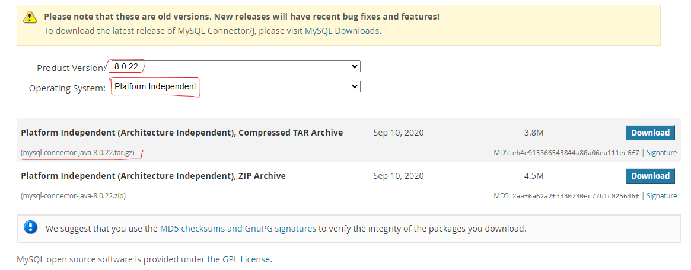
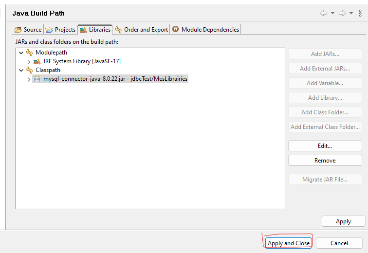
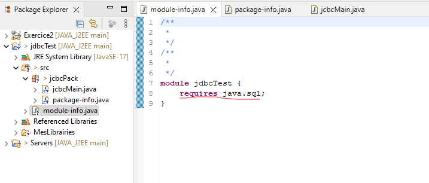

# Exercice 2 : (Java Database Connectivity)

Dans cet exercice, nous allons mettre en place un driver JDBC pour accéder à la base de données créée dans l’exercice précédent.

## Créer un projet Java Project `jdbcTest`

- Créer un dossier MesLibrairies
- Télécharger [mysql-connector-java-8.0.22.tar.gz](https://downloads.mysql.com/archives/c-j/), vous pouvez le trouver dans le dossier `ressources` 
- Copiez le fichier jar de cette librairie dans le répertoire MesLibrairies de votre projet jdbcTest.

## Ajoutez ce fichier jar au Build Path de votre projet.

- Clique droit sur le projet : `Build Path > Configure Build Path` ou `Project > Properties > Librairies` : 
- Selectionner le jar dans `MesLibrairies` 

## Créer le package `jcbcPack` et la classe `jcbcMain`

- Attention aux fichiers `module-info.java` et `package-info.java`, il vaut mieux les supprimer sinon il faut préciser dans `module-info.java` les importations que vous utilisez 

### Code : 
```java
package jcbcPack;

import java.sql.*;

public class jcbcMain {
    
    public static void main(String[] args) throws Exception {
        //Class.forName("com.mysql.jdbc.Driver"); //chargement du Driver
        System.out.println( "Affichage de la table Nations");
        String url = "jdbc:mysql://localhost:3306/UnionEuropeBD?serverTimezone=UTC";

        
        Connection con=DriverManager.getConnection(url,"userTest","userTest");
        
        String select = "SELECT * FROM Nations";
        
        PreparedStatement ps = con.prepareStatement(select);
        ResultSet rs=ps.executeQuery();
        
        while(rs.next())
        {
            String message = rs.getString("nom") + ", ";
            message = message + rs.getInt("population") + ".";
            System.out.println( message );
        }
        
        con.close();
        System.out.println( "Opération de lecture terminée");
    }
}
```


### Resultat :


## Remarques sur la base de données :
### 1 - Vous n'avez pas fait l'exercice 1 de ce TP
- Si vous n'avez pas fait l'exercice 1 avant de faire ceci , Vous pouvez créer une base de données MYSQL UnionEuropeBD avec XAMP ou WAMP SERVER ou AUTRES et ajoutez une table Nations .
- Ajouter un utilisateur userTest à cette base de données : UnionEuropeBD > Privilèges > Ajouter un compte d'utilisateur saisissez ensuite userTest comme nom et mot de passe puissez cochez Privilèges globaux  
  

- Si vous avez une erreur :` #1034 - Index corrompu dans la table: 'global_priv'; essayez de le réparer` :  Aller dans la base de données  `mysql` et tout cochez et reparer


### 1 - Vous avez  fait l'exercice 1 de ce TP:
Si vous avez complété l'execice 1 de ce TP , Vous n'avez rien à faire pour la base de données , Tout est déjà fait dans l'exercice précedent.
