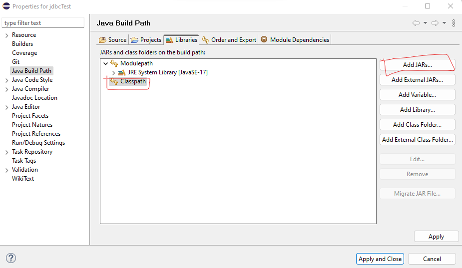
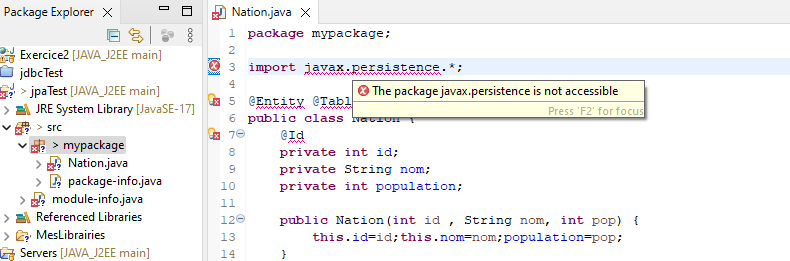
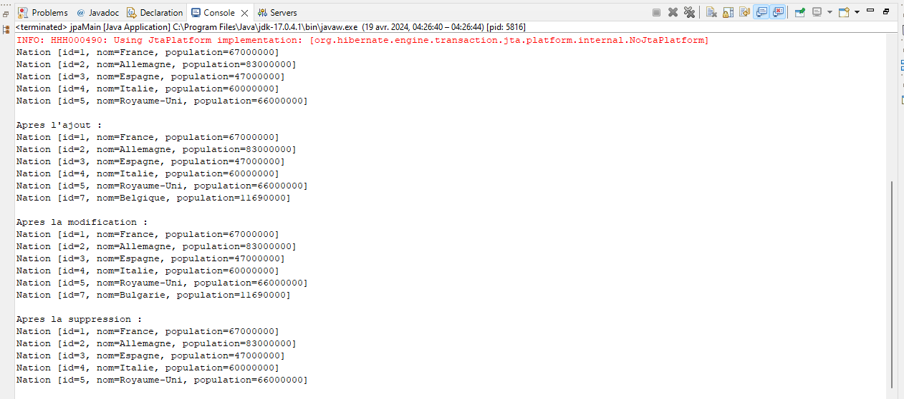
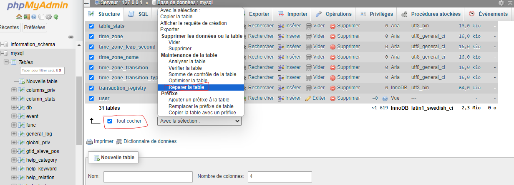

# Exercice 3 :  Java Persistence API - en Standalone
Dans cet exercice, nous allons créer une entité Class Nation qui sera mappée avec la seule table de notre base de données.

## Création du projet `jpaTest`
- 1. Lancez Eclipse IDE for Enterprise Java Developers.  
- 2. Créez un simple projet Java nommé `jpaTest` (et non pas une application web dynamique).  
- 3. Créez une classe Java nommée Nation avec les bons attributs
- 4. Utilisez habilement Eclipse pour automatiquement générer les getter et setter de ces attributs: `Clic droit > sources > Generate Getters and Setters`  
- 5. Ajoutez un constructeur sans argument à cette classe.  
### Code V1 :
```java
package myPackage;

public class Nation {
	private int id;
	private String nom;
	private int population;
	
	public Nation(int id , String nom, int pop) {
		this.id=id;this.nom=nom;population=pop;
	}
	
	public Nation() {
		id=0;
		nom="unknown";
		population=0;
	}

	public int getId() {
		return id;
	}

	public void setId(int id) {
		this.id = id;
	}

	public String getNom() {
		return nom;
	}

	public void setNom(String nom) {
		this.nom = nom;
	}

	public int getPopulation() {
		return population;
	}

	public void setPopulation(int population) {
		this.population = population;
	}

	@Override
	public String toString() {
		return "Nation [id=" + id + ", nom=" + nom + ", population=" + population + "]";
	}
	
	
	
}
```

## HIBERNATE 
- 6. Téléchargez et décompressez l’implémentation hibernate de la spécification [JPA ici](https://sourceforge.net/projects/hibernate/files/hibernate-orm/5.6.0.Final/hibernate-release-5.6.0.Final.zip/download) ou via https://hibernate.org/orm/.
	Indications : Il s’agit d’un fichier nommé `hibernate-release-xxx-final.zip`.  
- 7. Dans votre projet Eclipse, créez un répertoire `MesLibrairies`.  
- 8. Copiez tous les fichiers jar contenus du répertoire `hibernate-release-5.4.29.Final/lib/required/` vers le dossier `MesLibrairies`.  
- 9. Comme dans l’exercice précédent, ajoutez aussi au dossier MesLibrairies le fichier jar contenant le driver JDBC.  
- 10. Ajoutez tous ces fichiers jar au Build Path de votre projet. `Build Path > Configure Build Path` ou `Project > Properties > Librairies` : 

## Entité , Table , Id
- 11. Transformez votre classe Nation en entité avec l’aide d’annotations JPA comme `@Entity`,`@Table` et `@Id`.
- a - `@Entity` : Cette annotation est utilisée pour marquer une classe comme une entité persistante. Une entité est une classe qui est associée à une table dans une base de données relationnelle. L'utilisation de @Entity indique à JPA que cette classe doit être gérée par le framework de persistance.  
- b -`@Table` : Cette annotation est utilisée pour spécifier le nom de la table avec laquelle l'entité est associée dans la base de données. Par défaut, le nom de la table est le même que le nom de la classe, mais en utilisant `@Table`, vous pouvez spécifier un nom de table différent.   
- Dans le contexte de votre question, l'annotation `@Table(name = "Nations")` est utilisée pour spécifier que l'entité Nation est associée à la table Nations dans la base de données.
- c -`@Id` : Cette annotation est utilisée pour spécifier la clé primaire de l'entité.  
### Code V2 :
```java
package myPackage;

import javax.persistence.*;

@Entity @Table(name="Nations")
public class Nation {
	@Id
	private int id;
	private String nom;
	private int population;
	
	public Nation(int id , String nom, int pop) {
		this.id=id;this.nom=nom;population=pop;
	}
	
	public Nation() {
		id=0;
		nom="unknown";
		population=0;
	}

	public int getId() {
		return id;
	}

	public void setId(int id) {
		this.id = id;
	}

	public String getNom() {
		return nom;
	}

	public void setNom(String nom) {
		this.nom = nom;
	}

	public int getPopulation() {
		return population;
	}

	public void setPopulation(int population) {
		this.population = population;
	}

	@Override
	public String toString() {
		return "Nation [id=" + id + ", nom=" + nom + ", population=" + population + "]";
	}
	
}
```
### Attention ! :
- Si vous avez cette erreur c'=, c'est du au fichier `module-info.java`  

- Vous pouvez la corriger en supprimant simplement le fichier `module-info.java` 

## PESISTENCE
- La persistance de données fait référence à la capacité d'un programme informatique à stocker des données sur un support de stockage durable, tel qu'une base de données, de manière à ce que les données restent disponibles même après la fin de l'exécution du programme ou le redémarrage de l'ordinateur. La persistance permet de conserver l'état et les informations importantes d'une application au fil du temps.  
- Java Persistence API (JPA) est une spécification Java qui définit une API pour la gestion de la persistance des données dans les applications Java. Elle fournit un moyen standard pour les développeurs d'interagir avec les bases de données relationnelles à partir de Java en utilisant des entités Java plutôt que des requêtes SQL directes. JPA simplifie le développement d'applications en fournissant un modèle objet-relationnel (ORM) qui permet de mapper les objets Java sur des tables de base de données et de gérer les opérations de persistance, telles que l'insertion, la mise à jour et la suppression, de manière transparente.  
- Le fichier persistence.xml est un fichier de configuration utilisé dans les applications Java EE (Enterprise Edition) pour définir les paramètres de persistance des entités, ainsi que les propriétés de connexion à la base de données.  
- 12. Créez un fichier de configuration nommé `persistence.xml` dans le dossier `src/META-INF/` de votre projet. (Créez le dossier src/META-INF/ si nécessaire).
- 14. Créez une unité de persistance nommée `UniteUnionEurope`. 
```xml
<?xml version="1.0" encoding="UTF-8"?>
<persistence version="2.2"
	xmlns="http://xmlns.jcp.org/xml/ns/persistence"
	xmlns:xsi="http://www.w3.org/2001/XMLSchema-instance"
	xsi:schemaLocation="http://xmlns.jcp.org/xml/ns/persistence
	http://xmlns.jcp.org/xml/ns/persistence/persistence_2_2.xsd">
	<persistence-unit name="UniteUnionEurope">
		<provider>org.hibernate.jpa.HibernatePersistenceProvider</provider>
		<class>myPackage.Nation</class>
		<properties>
			<property name="javax.persistence.jdbc.driver" value="com.mysql.jdbc.Driver" />
			<property name="javax.persistence.jdbc.url" value="jdbc:mysql://localhost:3306/UnionEuropeBD?serverTimezone=UTC" />
			<property name="javax.persistence.jdbc.user" value="userTest" />
			<property name="javax.persistence.jdbc.password" value="userTest" />
		</properties>
	</persistence-unit>
	
</persistence>
```

- `<?xml version="1.0" encoding="UTF-8"?> :`
Cette déclaration indique que le fichier est un document XML et spécifie la version de l'encodage utilisé.
- `<persistence version="2.2" xmlns="http://xmlns.jcp.org/xml/ns/persistence" xmlns:xsi="http://www.w3.org/2001/XMLSchema-instance" xsi:schemaLocation="http://xmlns.jcp.org/xml/ns/persistence http://xmlns.jcp.org/xml/ns/persistence/persistence_2_2.xsd"> `:
Cet élément racine définit la version du fichier persistence.xml ainsi que les espaces de noms XML utilisés.
- `<persistence-unit name="UniteUnionEurope">` :
Cet élément définit une unité de persistance, qui est une collection d'entités persistantes et de configurations associées.
Le nom spécifié (UniteUnionEurope) est utilisé pour référencer cette unité de persistance dans le code de l'application.
- `<provider>org.hibernate.jpa.HibernatePersistenceProvider</provider>` :
Cet élément spécifie le fournisseur de persistance à utiliser. Dans cet exemple, Hibernate est utilisé comme fournisseur de persistance JPA (Java Persistence API).
- `<class>myPackage.Nation</class> :
Cet élément spécifie les classes d'entités qui doivent être prises en compte dans cette unité de persistance. Dans cet exemple, la classe Nation du package myPackage est spécifiée.
- `<properties>` :
Cet élément contient les propriétés de configuration de la connexion à la base de données.
Les propriétés sont spécifiées sous forme de paires clé-valeur, où la clé est le nom de la propriété et la valeur est la valeur de la propriété.
Dans cet exemple, les propriétés javax.persistence.jdbc.driver, javax.persistence.jdbc.url, javax.persistence.jdbc.user et javax.persistence.jdbc.password sont utilisées pour spécifier respectivement le pilote JDBC, l'URL de connexion à la base de données, le nom d'utilisateur et le mot de passe.

## EXECUTION
- 13. Dans un package `jpaPack`, créez une classe `jpaMain` avec une méthode main.
- 16. Ajoutez au code précédent des instructions s’appuyant sur l’objet entityManager afin de tester les opérations de création, mise à jour et suppression d’enregistrements.

```java
package jpaPack;
import java.util.List;
import javax.persistence.EntityManager;
import javax.persistence.EntityManagerFactory;
import javax.persistence.Persistence;
import javax.persistence.Query;

import myPackage.Nation;

public class jpaMain {
	
	public static void  lister(EntityManager entityManager  ) {
		Query q = entityManager.createQuery( "from Nation" , Nation.class );
		List<Nation> nations ;
		nations = q.getResultList();
		
		for (Nation n : nations) {
			System.out.println( n.toString() );
		}
	}
	
	public static void main(String[] args) throws Exception {
		EntityManagerFactory emf ;
		emf = Persistence.createEntityManagerFactory("UniteUnionEurope");
		EntityManager entityManager = emf.createEntityManager();
		Query q = entityManager.createQuery( "from Nation" , Nation.class );
		List<Nation> nations ;
		nations = q.getResultList();
		
		for (Nation n : nations) {
			System.out.println( n.toString() );
		}
		
		// Ajout d'un nouvel enregistrement
		entityManager.getTransaction().begin(); // Début de la transaction
		Nation nation = new Nation(7, "Belgique", 11690000); // Création d'une nouvelle instance de Nation
		entityManager.persist(nation); // Ajout de la nouvelle Nation à la base de données
		entityManager.getTransaction().commit(); // Validation de la transaction
		
		// Afficher la liste
		System.out.println("\nApres l'ajout :");
		lister(entityManager);
		
		
		// Mise à jour d'un enregistrement
		entityManager.getTransaction().begin(); // Début de la transaction
		Nation nationToUpdate = entityManager.find(Nation.class, 7); // Récupération de l'entité à mettre à jour
		nationToUpdate.setNom("Bulgarie"); // Modification de l'attribut
		entityManager.getTransaction().commit(); // Validation de la transaction
		
		// Afficher la liste
		System.out.println("\nApres la modification :");
		lister(entityManager);
		
		
		//Suppression d'un enregistrement
		entityManager.getTransaction().begin(); // Début de la transaction
		Nation nationToDelete = entityManager.find(Nation.class, 7); // Récupération de l'entité à supprimer
		entityManager.remove(nationToDelete); // Suppression de l'entité de la base de données
		entityManager.getTransaction().commit(); // Validation de la transaction
		
		// Afficher la liste
		System.out.println("\nApres la suppression :");
		lister(entityManager);
		
		
	}

}

```

`jpaMain.java > Run As > Java Apllication`



