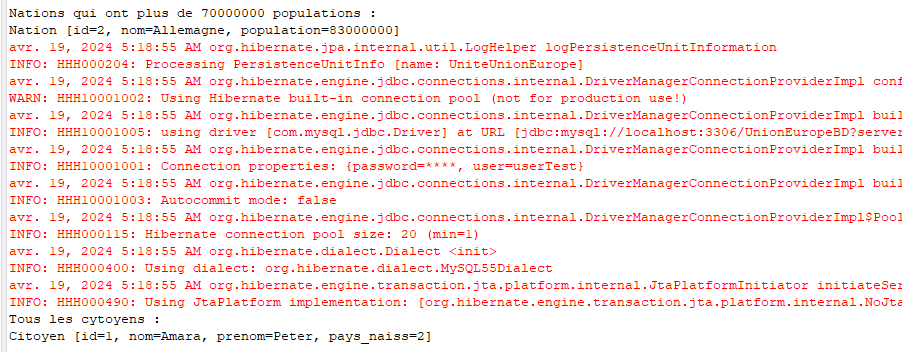

# Exercice 4 (Dao sur JPA)
- Ceci est la suite de l'exercice précedent : `jpaTestDAO`
## Couche DAO (Accès aux données)
- Nous allons donc créer un package `dao` dans lequelle nous mettons pour chaque DAO une `interface` et `une classe qui l'implemente`
- 1. Mettez en place le patron de conception DAO afin de proposer :
(a) une méthode qui liste toutes nations qui ont plus n citoyens,
(b) une méthode qui permet de modifier le nombre d’habitants d’une nation donnée.

### Interface `INationDAO`
```java
package dao;

import java.util.List;

import myPackage.Nation;

public interface INationDAO {
	public List<Nation> nationsPluscitoyens(int n);//une m�thode qui liste toutes nations qui ont plus n citoyens,
	public void modifierNbPopulation(int id , int nbPop);//une m�thode qui permet de modifier le nombre d�habitants d�une nation donn�e.

}

```
### Classe `NationDAO`
```java
package dao;

import java.util.List;

import javax.persistence.EntityManager;
import javax.persistence.EntityManagerFactory;
import javax.persistence.Persistence;
import javax.persistence.Query;

import myPackage.Nation;

import java.util.*;

public class NationDAO implements INationDAO {
	private EntityManager entityManager;
	
	public NationDAO() {
		EntityManagerFactory emf ;
		emf = Persistence.createEntityManagerFactory("UniteUnionEurope");
		entityManager = emf.createEntityManager();
	}

	@Override
	public List<Nation> nationsPluscitoyens(int n) {
		Query q = entityManager.createQuery( "from Nation" , Nation.class );
		List<Nation> nations ;
		nations = q.getResultList();
		
		ArrayList<Nation> citoyens= new ArrayList<Nation>();
		
		for (Nation na : nations) {
			if(na.getPopulation()>=n) {
				citoyens.add(na);
			}
		}
		
		return citoyens;
	}

	@Override
	public void modifierNbPopulation(int id , int nbPop) {
		// Mise � jour d'un enregistrement
		entityManager.getTransaction().begin(); // D�but de la transaction
		Nation nationToUpdate = entityManager.find(Nation.class, id); // R�cup�ration de l'entit� � mettre � jour
		nationToUpdate.setPopulation(nbPop); // Modification de l'attribut
		entityManager.getTransaction().commit(); // Validation de la transaction
		
	}

}

```
## Table Cytoyens
2. Ajouter une table nommée Citoyens à votre base avec les champs Id, nom, prenom et une clé étrangère pour connaître le pays de naissance.
- créer une nouvelle table `cytoyens(id,nom,prenom,id_nation)`  ou utiliser `unioneuropebd2.sql`.

## JPA 
- 3. Développez le code JPA permettant de persister facilement des citoyens dans votre base.
### Classe 
- Créons une classe `Citoyen` dans le package `myPackage`
```java
package myPackage;
import javax.persistence.*;

@Entity @Table(name="Citoyens")
public class Citoyen {
	@Id
	private int id;
	private String nom;
	private String prenom;
	
	@Column(name = "id_nation")
	private int pays_naiss;
	
	public Citoyen(int id , String no, String pr, int nat) {
		this.id=id;nom=no;prenom=pr;pays_naiss=nat;
	}
	
	
	public Citoyen() {
		id=0;
		nom="unknown";
		prenom="unknown";
	}

	public int getId() {
		return id;
	}

	public void setId(int id) {
		this.id = id;
	}

	public String getNom() {
		return nom;
	}

	public void setNom(String nom) {
		this.nom = nom;
	}

	public String getPrenom() {
		return prenom;
	}

	public void setPrenom(String prenom) {
		this.prenom = prenom;
	}

	public int getPays_naiss() {
		return pays_naiss;
	}

	public void setPays_naiss(int pays_naiss) {
		this.pays_naiss = pays_naiss;
	}

	@Override
	public String toString() {
		return "Citoyen [id=" + id + ", nom=" + nom + ", prenom=" + prenom + ", pays_naiss=" + pays_naiss + "]";
	}
	
}
```

### Persistence XML
- Nous allons ajouter cette classe dans la persistence.xml
```xml
<?xml version="1.0" encoding="UTF-8"?>
<persistence version="2.2"
	xmlns="http://xmlns.jcp.org/xml/ns/persistence"
	xmlns:xsi="http://www.w3.org/2001/XMLSchema-instance"
	xsi:schemaLocation="http://xmlns.jcp.org/xml/ns/persistence
	http://xmlns.jcp.org/xml/ns/persistence/persistence_2_2.xsd">
	<persistence-unit name="UniteUnionEurope">
		<provider>org.hibernate.jpa.HibernatePersistenceProvider</provider>
		<class>myPackage.Nation</class>
		<class>myPackage.Citoyen</class>
		<properties>
			<property name="javax.persistence.jdbc.driver" value="com.mysql.jdbc.Driver" />
			<property name="javax.persistence.jdbc.url" value="jdbc:mysql://localhost:3306/UnionEuropeBD?serverTimezone=UTC" />
			<property name="javax.persistence.jdbc.user" value="userTest" />
			<property name="javax.persistence.jdbc.password" value="userTest" />
		</properties>
	</persistence-unit>
	
</persistence>
```

## DAO Cytoyen
4. Ajoutez une méthode à votre DAO pour récupérer tous les citoyens d’une nation donnée.

### Interface
```java
package dao;

import java.util.List;

import myPackage.Citoyen;

public interface ICitoyenDAO {
	public void add(Citoyen c);
	public List<Citoyen> getAllCitoyen();
}
```

### Classe
```java
package dao;

import java.util.ArrayList;
import java.util.List;

import javax.persistence.EntityManager;
import javax.persistence.EntityManagerFactory;
import javax.persistence.Persistence;
import javax.persistence.Query;

import myPackage.Citoyen;
import myPackage.Nation;

public class CitoyenDAO implements ICitoyenDAO {
private EntityManager entityManager;
	
	public CitoyenDAO() {
		EntityManagerFactory emf ;
		emf = Persistence.createEntityManagerFactory("UniteUnionEurope");
		entityManager = emf.createEntityManager();
	}

	@Override
	public void add(Citoyen c) {
		// TODO Auto-generated method stub
		// Ajout d'un nouvel enregistrement
		entityManager.getTransaction().begin(); // D�but de la transaction
		entityManager.persist(c); // Ajout de la nouvelle Nation � la base de donn�es
		entityManager.getTransaction().commit(); // Validation de la transaction
		
	}

	@Override
	public List<Citoyen> getAllCitoyen() {
		Query q = entityManager.createQuery( "from Citoyen" , Citoyen.class );
		List<Citoyen> citoyens ;
		citoyens = q.getResultList();
		return citoyens;
	}
}

```

## EXECUTION
- Nous allons ajuster la classe `jpaMain`

```java
package jpaPack;
import java.util.List;
import javax.persistence.EntityManager;
import javax.persistence.EntityManagerFactory;
import javax.persistence.Persistence;
import javax.persistence.Query;

import dao.CitoyenDAO;
import dao.NationDAO;
import myPackage.Citoyen;
import myPackage.Nation;

public class jpaMain {	
	public static void main(String[] args) throws Exception {

		
		NationDAO dao = new NationDAO();
		int nbPop=70000000;
		
		List<Nation> nations=dao.nationsPluscitoyens(nbPop);
		
		System.out.println("\nNations qui ont plus de "+nbPop+ " populations :");
		for(Nation n :nations)
			System.out.println(n);
		
		//dao.modifierNbPopulation(2, 70000000);
		
		CitoyenDAO cidao = new CitoyenDAO();
		Citoyen peter= new Citoyen(1,"Amara","Peter",2);
		cidao.add(peter);
		
		List<Citoyen> citoyens =cidao.getAllCitoyen();
		
		System.out.println("Tous les cytoyens : ");
		for(Citoyen n :citoyens)
			System.out.println(n);
		
	}

}
```

### CONSOLE


